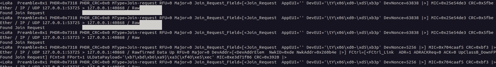

## LoRAttack

This repository provides a toolkit for assessing LoRaWAN network security. Here's what it offers:

* **Multi-Channel Sniffing:** Capture LoRaWAN traffic across multiple channels using an SDR (Software Defined Radio).
* **Session-Based Capture:** Create and manage sessions. Captured handshakes within a session are automatically stored for further analysis.
* **Key Derivation:** Derive cryptographic keys from captured handshake data specific to a session, enabling decryption of packets belonging to that session.
* **Wireshark Compatibility:** Stores captured traffic in PCAP files with a modified DLT number, ensuring seamless analysis with Wireshark.
* **Vulnerability Testing:** Replay specific payloads to probe for known LoRaWAN vulnerabilities during security assessments.
* **Attack Guidance:** Access detailed descriptions of attacks and step-by-step guides to streamline your testing process.


# Table of Contents
- [**Installation**](#installation)
- [**Usage**](#usage)
  - [**Session**](#session)
  - [**Sniffer**](#sniffer)
    - Sniff
    - Configure
    - Decoding and Decryption
    - Packet Storage
  - [**Analyzer**](#analyzer)
  - [**Attack**](#attack)
    - Replay
    - Craft packets
  - **[Exit](#exit)**


## Installation

**Requirements:**

* Linux system (tested with Ubuntu, Debian)
* USRP Software-Defined-Radio by Ettus Research (tested with B200, B205mini)

**1. Install GNU Radio and Dependencies:**

Follow the instructions on the GNU Radio wiki for your Linux distribution: [https://wiki.gnuradio.org/index.php/InstallingGR](https://wiki.gnuradio.org/index.php/InstallingGR)

**2. Install USRP Hardware Drivers:**

Add the Ettus Research USRP repository:

```bash
sudo add-apt-repository ppa:ettusresearch/uhd
sudo apt-get update
sudo apt-get install libuhd-dev uhd-host
```


**3. Clone the LoRa Attack Toolkit Repository:**

```bash
git clone https://github.com/konicst1/lorattack.git
```

**4. Install Dependencies:**

Navigate to the toolkit directory and install dependencies:

```bash
cd lorattack
source venv/bin/activate
pip install -r requirements.txt
```

Also install gr-lora libraries from:

* https://github.com/rpp0/gr-lora 
* https://github.com/tapparelj/gr-lora_sdr 

**5. Update Python Paths (if using virtual environment):**

This step ensures the virtual environment can access gnuradio installed outside the environment.

```bash
export PYTHONPATH=/usr/local/lib/python3.10/dist-packages:/usr/lib/python3.10/site-packages:$PYTHONPATH
export PYTHONPATH="/usr/lib/python3/dist-packages:$PYTHONPATH"

# Update library path (if necessary)
export LD_LIBRARY_PATH=/usr/local/lib:$LD_LIBRARY_PATH
```

**Note:** Replace `/usr/local/lib/python3.10` with the actual path to your Python 3 installation directory if it's different. Adjust the library path update (`export LD_LIBRARY_PATH...`) only if encountering issues related to missing libraries.

**6. Run the LoRa Attack Toolkit:**

```bash
./run.sh
```

**Note:** Refer to the toolkit's documentation (if available) for detailed usage instructions.

## Usage

### Session

* **New Session:** Create a new session with a descriptive name whenever you start sniffing LoRaWAN traffic. This ensures each capture has its own set of keys for decryption later.
* **Choose Session:** Select an existing session to activate it for further analysis or replay attacks. LoRAttack uses handshake data from the chosen session to derive decryption keys specific to that capture.

Separate sessions are important for decryption. Each session in LoRAttack extracts handshake data to derive unique keys for captured packets within that session, enabling detailed analysis.

To edit session data, edit the _session/data/<session_name>/data.json_ file.


### Sniffer

LoRAttack's sniffer captures LoRaWAN traffic across multiple channels around a specified center frequency, enabling real-time decoding and decryption (if keys are available).


* **Sniff:** This submenu allows you to capture LoRaWAN traffic:
    * **Sniff Up/Down link (Bidirectional):** Starts capturing both uplink (devices to network) and downlink (network to devices) traffic. **Note:** Bidirectional capture may result in duplicate packets if the same data is sent in both directions.
    * **Sniff Uplink:** Starts capturing only uplink traffic.
    * **Sniff Downlink:** Starts capturing only downlink traffic.
* **Configure:** This submenu lets you edit the sniffer configuration file (`config/sniffer.config`) which defines capture settings:
    * **Frequency (Center Frequency):** Specify the center frequency (e.g., "868.6e6") for sniffing. LoRAttack will also capture channels around this center frequency based on the chosen bandwidth.
    * **Bandwidth:** Set the channel bandwidth (e.g., "125000") to define the range of frequencies captured around the center frequency.
    * **Sample Rate:** Define the sampling rate (e.g., "1000000") for the SDR hardware.
    * **Spreading Factor:** Specify the spreading factor (7 - 12) used by the LoRaWAN network (affects data rate and range).
    * **Gain (dB):** Set the gain (e.g., "10 dB") of the SDR antenna to adjust signal strength.

**Decoding and Decryption:**

* Captured packets are decoded in real-time, providing insights into the LoRaWAN communication structure.
* Decryption is possible and performed automatically if cryptographic keys are present in session config file:
    * Keys can be specified manually.
    * Keys can be derived automatically if Join Request and Join Accept messages are captured within (AppKey must be configured manually)



**Packet Storage:**

* All sniffed packets are stored in PCAP format within the current session's directory.
* PCAPs with _wireshark_ prefix have the UDP header stripped and DLT is set to _lorawan (147)_ for easy analysis with Wireshark.

### Analyzer

The Analyzer submenu displays a list of PCAP files associated with your active session. Selecting a PCAP file initiates an analysis process:


* **Traffic Analysis:** The analyzer examines the packet structure and decodes the LoRaWAN communication and updates session values if Join Request/Accept messages are found.
* **Decryption (if applicable):** If the session configuration contains the necessary cryptographic keys (NwkSKey and AppSKey), the analyzer attempts to decrypt the packet payloads.


## Attack


* **Replay:** 
    * **From PCAP:** Select a PCAP file (containing captured packets) from the listed options to replay a sequence of packets.
    * **Edit Replay Sequence:** Manually edit the packet sequence from the chosen pcap to be replayed.
* **Craft packets:**
  * **Spoof Join Request:** Crafts a Join Request message based on values from the current session (JoinEUI, DevEUI) and transmits it with SDR. If some of them are not present, default values are applied. AppKey/NwkKey is required to compute MIC.
  * **Spoof Join Accept:** Crafts a Join Request message based on values from the current session (NetID, DevAddr) and transmits it with SDR. If some of them are not present, default values are applied. AppKey/NwkKey is required to compute MIC and encryption.
  * **Spoof ACK Message:** Crafts and ACK message based on values from the session data (DevAddr, FCnt is set to 0xFFF0 to good chances for DoS) and transmits it with SDR. NwkSKey is required for MIC computation.

* **Configure transmitter:** Refer to the Sniffer Configuration section for details on configuring transmitter parameters used during replay attacks (e.g., frequency, gain).

This revised section avoids code snippets and focuses on user-friendly descriptions of the attack functionalities. It also clarifies the purpose of each attack option. 
### Exit

This option exits the LoRAttack tool.

### Attack simulation guidelines
TBD

